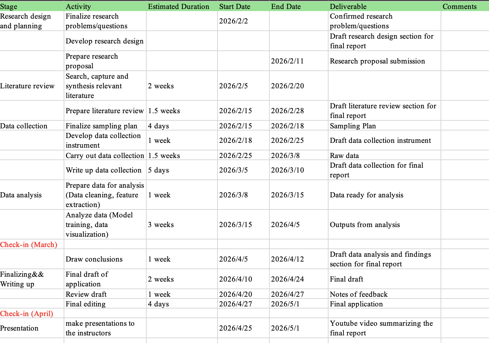

# Stock-Trading-Strategy

## Project Description

The objective of this project is to construct a short-term stock price prediction model based on historical stock price data and options market data, aiming to forecast the stock price trend for the next trading day. This project will utilize stock trading information from the previous trading day, including opening price, closing price, highest price, lowest price, trading volume, etc., as well as options market-related data, such as implied volatility, options trading volume, put/call ratio, etc., as the main input features.
In terms of methodology, the project will utilize statistical analysis and machine learning models to establish a correlation model between stock prices and option data, and predict the direction or magnitude of stock price changes on the next trading day. Based on the prediction results, corresponding trading strategies will be further designed, and historical data will be used to backtest their actual performance.

### Timeline

<!--  -->

| Stage | Activity | Estimated Duration | Start Date | End Date | Deliverable | Comments |
|------|---------|-------------------|-----------|----------|-------------|----------|
| Research design and planning | Finalize research problems/questions |  | 2026/2/2 |  | Confirmed research problem/questions |  |
|  | Develop research design |  |  |  | Draft research design section for final report |  |
|  | Prepare research proposal |  |  | 2026/2/11 | Research proposal submission |  |
| Literature review | Search, capture and synthesis relevant literature | 2 weeks | 2026/2/5 | 2026/2/20 |  |  |
|  | Prepare literature review | 1.5 weeks | 2026/2/15 | 2026/2/28 | Draft literature review section for final report |  |
| Data collection | Finalize sampling plan | 4 days | 2026/2/15 | 2026/2/18 | Sampling Plan |  |
|  | Develop data collection instrument | 1 week | 2026/2/18 | 2026/2/25 | Draft data collection instrument |  |
|  | Carry out data collection | 1.5 weeks | 2026/2/25 | 2026/3/8 | Raw data |  |
|  | Write up data collection | 5 days | 2026/3/5 | 2026/3/10 | Draft data collection for final report |  |
| Data analysis | Prepare data for analysis (Data cleaning, feature extraction) | 1 week | 2026/3/8 | 2026/3/15 | Data ready for analysis |  |
|  | Analyze data (Model training, data visualization) | 3 weeks | 2026/3/15 | 2026/4/5 | Outputs from analysis |  |
| Check-in (March) |  |  |  |  |  |  |
|  | Draw conclusions | 1 week | 2026/4/5 | 2026/4/12 | Draft data analysis and findings section for final report |  |
| Finalizing & Writing up | Final draft of application | 2 weeks | 2026/4/10 | 2026/4/24 | Final draft |  |
|  | Review draft | 1 week | 2026/4/20 | 2026/4/27 | Notes of feedback |  |
|  | Final editing | 4 days | 2026/4/27 | 2026/5/1 | Final application |  |
| Check-in (April) |  |  |  |  |  |  |
| Presentation | Make presentations to the instructors |  | 2026/4/25 | 2026/5/1 | YouTube video summarizing the final report |  |

## Clear goals

The primary objective of this project is to utilize stock price trends from the previous trading day and option market data to successfully predict stock price movements for the next trading day, and to construct a trading model that outperforms the buy-and-hold strategy in historical backtesting.
Specific objectives include:
1. Construct a feature system encompassing stock trading data and options market indicators;
2. Train a predictive model to determine the trend or magnitude of stock price changes on the next trading day;
3. Design an executable trading strategy based on the prediction results;
4. Through historical backtesting, compare the performance of this strategy in terms of return and risk with that of the buy-and-hold strategy to verify its effectiveness.

## Data Collection

### Features

**For this project, we wish to collect the stock information with following features:**

- Stock price (Bid, Ask, Close, Volume, Open_Interest)
- Date
- Strike_Price
- Expiry_Date 
- Call/Put_Flag
- Greeks & IV
- Implied_Volatility 
- Delta 
- Gamma 
- Vega 
- Theta 

**The data collected above is all about the stock data but not have the information about the market data such as the interest rate and the VIX. So we wish to also collect the following features:**

- Benchmark Indices
- Volatility Indices
- Interest Rates
### Data Source

All the data above can be found in the WRDS (Wharton Research Data Services)(https://wrds-www.wharton.upenn.edu/). It contains the OptionMetrics database, which is industrial-level historical option data. We can use the school email to register an account and download the data in CSV format. 

### Data Visualization Plan
We plan to use the following **tools** to visualize the data:

- Matplotlib
- Seaborn
- Plotly

We are thinking of using the following **charts** to visualize the data:

- **Standard OHLC + Volume:** to show the Candlestick Chart and Volume Bars.
- **Dual-Axis Line Chart:** to visualize the Stock Price and Implied Volatility. In this way, we can circle those moments when stock prices plummeted and IV skyrocketed.
- **Correlation Heatmap:** Put your features (IV, Gamma, PCR, VIX) and target variable (Next_Day_Return) together to see the correlation between them.

